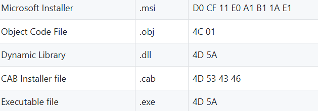

## Hunting Malware with Powershell and Virus Total. ##

In my previous articles, I've used PowerShell to demonstrate how to build a **TCP port scanner**,
how to find the **"weak password"** and how to use WMI with PowerShell for task automation. 
And I was wondering if I could build something more practical and useful from the SOC analyst or blue team if you prefer, 
point of view and eventually decided to build a simple tool to help me with hunting for malicious files.
I’m not going to talk about topics like, Reverse engineering, 
static or dynamic malware analysis or even how to analyse computer memory in searching 
for **"malware Artifacts"** (footprints it leaves in the system), but we will start with something much more easier.
YUP. Before you start running you should learn how to walk. Thus, when creating this “tool”
I will stick to my favourite design rule, KISS (keep it simple stupid). So, what is it all about then? 
Well, it will be about file extensions. Yes, I know this topic seems to be boring and has nothing to do with malware hunting.
But, it’s not entirely true. Hackers have been doing this since I remember and it’s the oldest method how to disguise your malicious program with fake extension. 
It’s worth to mention that Windows system hides well known extensions by default?, 
so first step would be to untick **“hide extensions for known files”**.

For example, your myFile.jpg may in fact be myFile.jpg.exe! If you click such file it would be executed as .exe file.
However, it still might be easy to detect, but what if attacker renames the file or 
removes extension entirely and malicious.exe becomes myPrettyPicture.jpg and later on something else will 
trigger this file to rename and execute? What then? Well, there is a magic word for that and it’s literally 
called **“File Magic Number”**. And this is how you could determine if a “suspicious” file is a genuine one and corresponds 
to its own extension. Think of it as a file “signature” or file ID which is hardcoded in the file. 
Detecting such “signature” in files is a very effective way of distinguishing between many file formats. 
More about file format [here on wikipedia: en.wikipedia.org/wiki/File_format](https://en.wikipedia.org/wiki/File_format)

And this is how magic number looks like in **Hexadecimal notation.**



Windows calc.exe loaded into a HEX editor will show 4D 5A in hex and “MZ” - ASCII , 
which are the initials of Mark Zbikowski, one of leading developers of [MS-DOS](https://en.m.wikipedia.org/wiki/MS-DOS).


Fun fact about **HEX CODES.**

*Some Programmers use HEX codes for magic numbers as memorable words to make them very unique and sometimes even spooky :) It’s worth to mention that debuggers make use of them as well.*

Example of spooky codes

   * 0xBAADF00D – (” Bad Food”) Memory allocated by LocalAlloc() with LMEM_FIXED, but not written to.
   * 0xFEE1DEAD – (“Feel Dead”) A magic number used in the Linux reboot system call.
   * 0xDEADFA11 – (“Dead Fall”) Also used in the Apple iOS crash reports when a user quits the application

And the winner is ? ....

   * 0xB16B00B5 ("big boobs") was required by Microsoft's Hyper-V hypervisor to be used by Linux guests as   their "guest signature".[5] One proposal suggested changing it to 0x0DEFACED ("defaced").[6] Actually, it was initially changed to decimal and then replaced entirely :)

More about [HexSpeak on Wiki](https://en.wikipedia.org/wiki/Hexspeak)

So even if you change the extension of this file it still can be detected by matching the **magic number**. But obviously, even if magic number corresponds to its extension it does not guarantee that file is safe, it still might contain some malicious code. And here I thought it would be nice to verify file integrity using MD5 and SHA1 hash and upload it to **Virus Total** to determine if our file is safe or it has been tampered and contains some malicious payload. A cryptographic hash is a derived from the contents of a file, creating a unique ‘fingerprint’ that will change if the file changes. And this is how we know that file content has not been changed. And I believe it’s a great way how to establish a basic but practical **file integrity check**.

Let's create some example and play with it for a moment.

I've got an unchanged file with calculated SHA1 hash and another one after I made some changes.


They all look the same !! Did I change anything ? Yes I have added a hidden text to it !


You would not noticed any difference unless you use a Hex editor.

So they might look the same but after integrity check I can tell they are different and file content has been tampered with an additional content.


This technique is called Steganography and you can read more about it here [www.garykessler.net/library/steganography.html](https://www.garykessler.net/library/steganography.html).

OK! and now I will explain what my script does. 
I’ve created few different functions which allow me to do the following

Function **Get-FileSignature**, snippet below

```
$global:FileSignature = New-Object System.Collections.ArrayList


Get-ChildItem -Path $Path -Recurse -Exclude $Exclusion | ?{-not $_.psiscontainer -and $_.length -lt $FileSize } | %{


$Props=@{
  fullname=$_.FullName
  extension=$_.Extension
  name=$_.Name
  signature=[system.bitconverter]::ToString((Get-Content $_ -TotalCount 8 -ReadCount 1 -Encoding byte) ) -replace '-',' '
  hashes=$null
}

$Tmp= New-Object -TypeName psobject -Property $Props
$Tmp.hashes=New-Object -TypeName psobject -Property @{
  md5=Get-FileHash $_ -Algorithm MD5 | select -ExpandProperty hash
  sha256=Get-FileHash $_ -Algorithm sha1 | select -ExpandProperty hash
}

```
